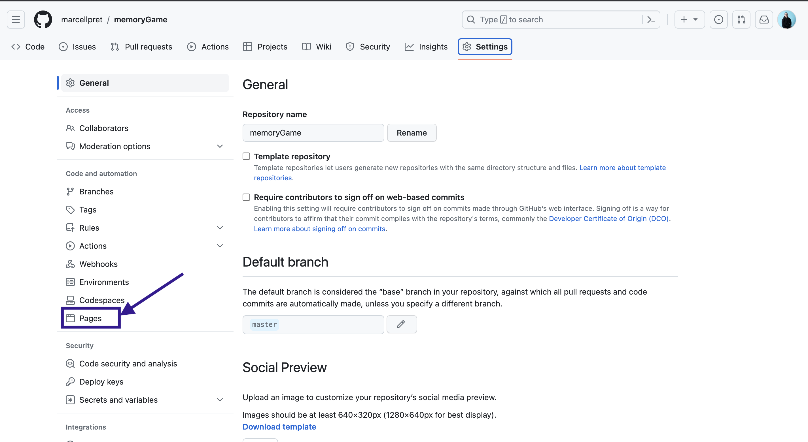
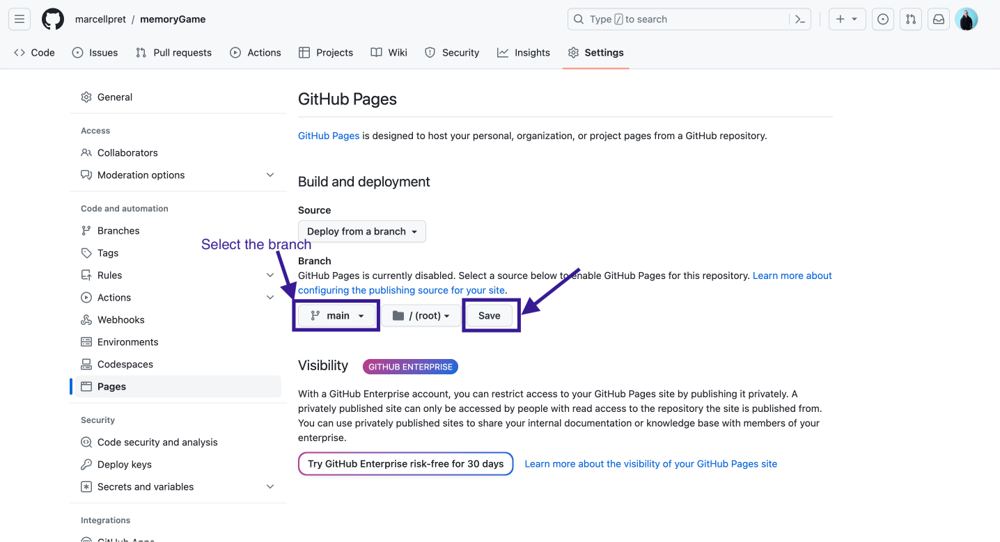
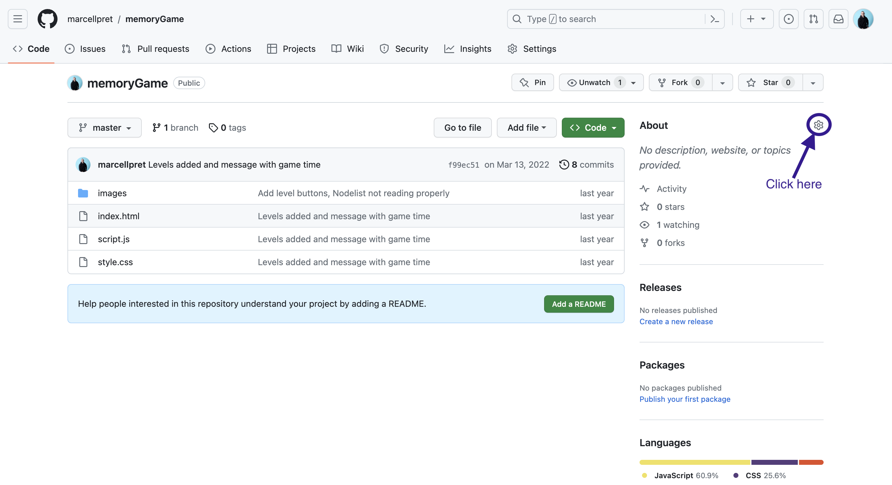
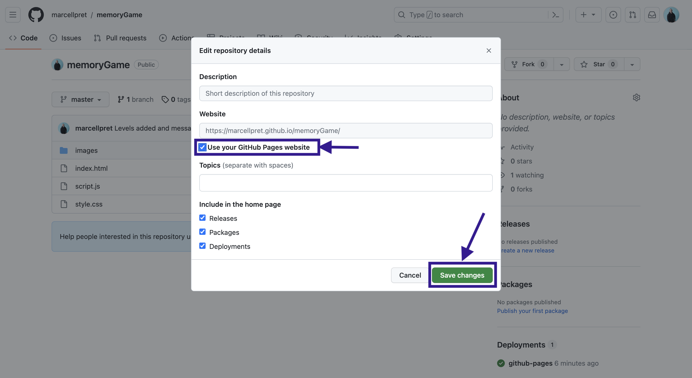

# Deploy Your Website to GitHub Pages

We will deploy, or publish, our web page(s) to GitHub Pages. Please note that this approach works well for websites built with HTML, CSS and vanilla Javascript. For React or other frameworks, please refer to the [Vercel Deployment Guide](deployment-vercel.md).

> ❗️ We will publish the contents of a specific **branch** and a specific **folder** within that branch. For simplicity, ensure that your main file (e.g., `index.html`) is located at the root of the repository, not inside a sub-folder.

## Steps to Deploy

1. On GitHub, navigate to your repository.
2. Open the `Settings` tab of the repository.
3. From the left-hand menu, select `Pages`.
   

4. Select the branch you want to deploy. In our case, we will choose `main`. Click `Save`.
   > Please note that you can also select a **directory** to deploy before clicking `Save`, e.g., if the folder you want to deploy is not at the root of your repository.

   

5. Your website is now deployed! To find the URL, click on the `Code` tab to return to your repository's main page.
6. Add the URL in the `About` section of your repository.
   
7. On the pop-up, select `Use your Github Pages website` and then click `Save changes`.
   
8. Your website’s URL is now displayed in the `About` section of your repository. Click on it to view your page!

For more detailed information about deploying a website to GitHub Pages, refer to the [official GitHub Pages documentation](https://docs.github.com/en/pages/getting-started-with-github-pages/creating-a-github-pages-site).
