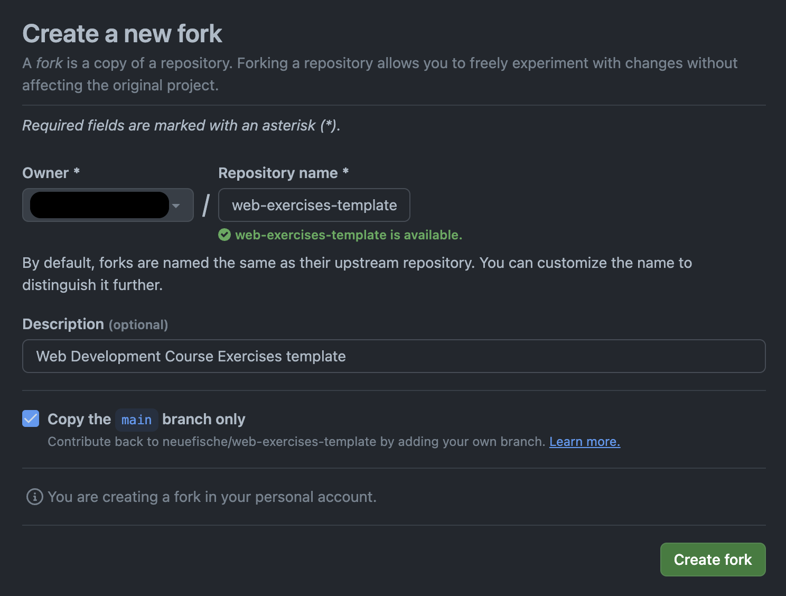
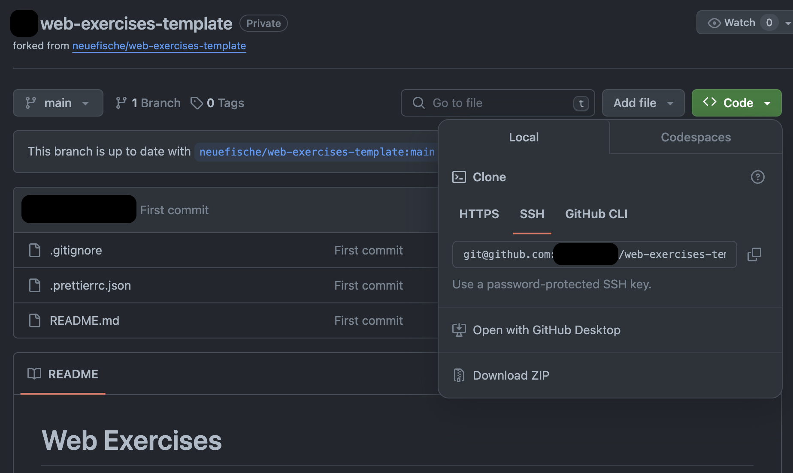

# How to share your exercises

You will commit your exercises progress to a personal repository on Github.

## Fork the template

[Visit the template page](https://github.com/neuefische/web-challenges-template), rename the fields to just `web-exercises` then click on **Use this template** / **Create a new repository**:



Now fill the information on the next form like:



- **owner**: your github user (not any organisation in case it shows up);
- **name**: web-challenges;
- **view**: public.

Copy the git URL that you see after clicking on the green **Code** button / SSH, then clone it locally:


```
git clone git@github.com:<your-username>/web-challenges.git
```

> **Important:** make sure to be _outside_ of any other git repository you have on your machine!

## Working locally

After every session, you'll find instructions about how to download the corresponding challenges, like:

```
cd web-challenges
npx ghcd@latest neuefische/web-exercises/tree/main/sessions/css-flexbox/profile
```

This will create a new folder with the challenge, that you can access in VSCode and start working on:

```
cd css-flexbox_profile
code .
```

Whenever you are satisfied with your progress, commit your changes and push them to your remote repository:

```
git add index.html styles.css
git commit -m "Solve css-flexbox profile challenge"
git push
```

You can now share the remote github URL on the Slack Solutions / Questions thread.

## Folder organisation

No local folder structure is enforced, you are free to group your exercises as you see fit (e.g. by topic or date) as long as the folder names reflect the challenge it contains.