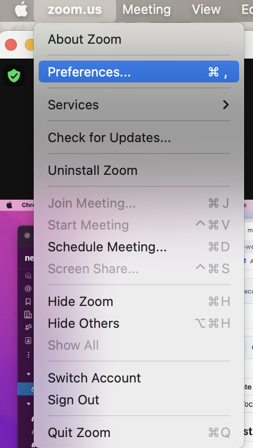
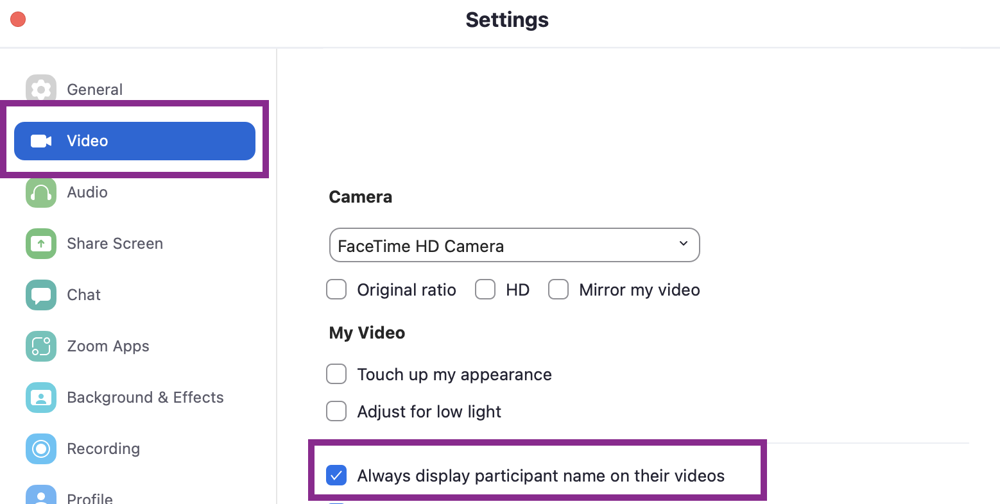

# Zoom: Always Display Participant Names

The attendance images must show the names of all participants.

## 1. Open Zoom Settings:

   

## 2. Check the box for "Always display participant names"

   

## 🎉 Done!
