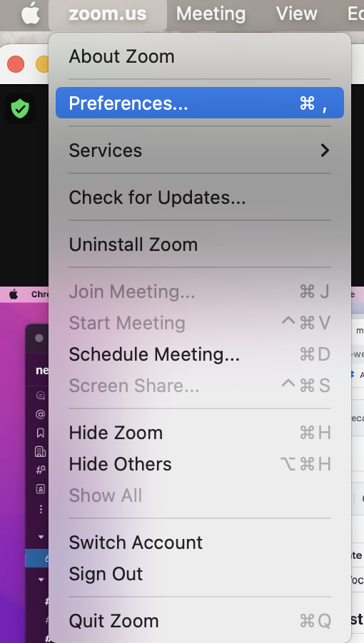
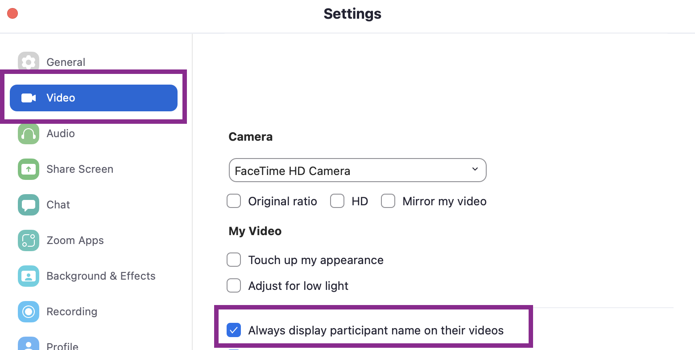

# Zoom: Namen der Teilnehmer:innen immer anzeigen

Auf den Anwesenheitsbildern müssen **die Namen aller Teilnehmer:innen** sichtbar sein.

## 1. Öffne die Zoom-Settings:

## 2. Setze das Häkchen bei "Namen der Teilnehmer:innen immer anzeigen"

## 🎉 Fertig!
