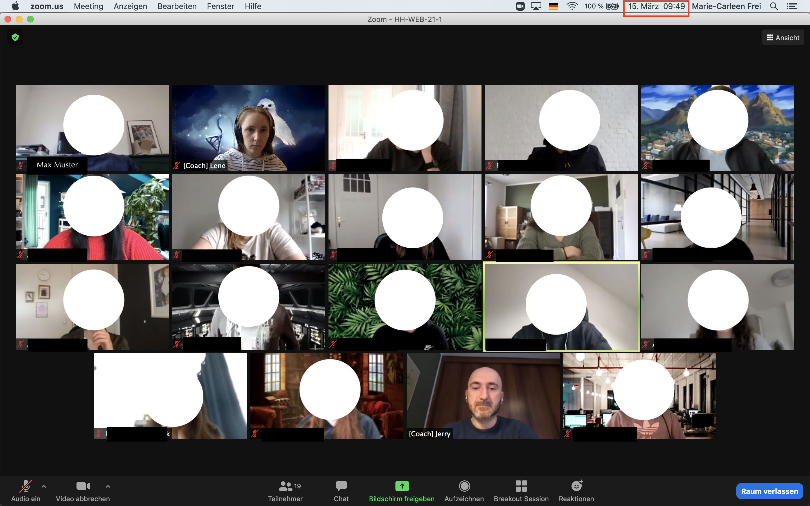

## Checklist

_(Please delete once everything has been completed)_

- [ ] Daily screenshot of attendance
- [ ] `next-author` has been written down
- [ ] `README.md` has been updated
- [ ] Preview of `README.md` and this page has been checked

## Themen

- Course Intro
- Meeting everyone
- Install and arrange MacBooks

---

## Notizen

### Course Intro

- Foo
- Bar

---

## Material & Links

### Course Intro

- [Bootcamp Manual](../docs/bootcamp-manual.md)

### Install and arrange MacBooks

- [Shell Setup Script](https://github.com/neuefische/zsh-setup)
- [How to find your macs home folder and add it to finder](https://www.cnet.com/how-to/how-to-find-your-macs-home-folder-and-add-it-to-finder/)
- [How to use spaces](https://appleinsider.com/articles/18/10/12/how-to-use-spaces-apples-mostly-ignored-macos-mojave-productivity-feature)
- [Keyboard Shortcuts](https://www.elementalidad.com/2017-11-06-keyboard-shortcuts)
- [Cheatsheet Shell](https://github.com/LeCoupa/awesome-cheatsheets/blob/master/languages/bash.sh)

---

## Aufgaben

1. Erstelle Dir einen GitHub-Account. Dein GitHub-Name sollte:
   - auch in professionellen Kontexten funktionieren (kein supersexyfunnybunny, etc)
   - je nach Unternehmen allerdings anders... you be the judge
   - klein und zusammen geschrieben
2. Sende Deinen GitHub-Namen in den Thread auf Slack
3. Mache dich mit Version Control und Git vertraut:
   - [Video](https://www.youtube.com/watch?v=8oRjP8yj2Wo) über Versionskontrolle (version control) anschauen
   - [Git in plain English](https://blog.red-badger.com/2016/11/29/gitgithub-in-plain-english)

---

## Open Questions

-

---

## Anwesenheit

